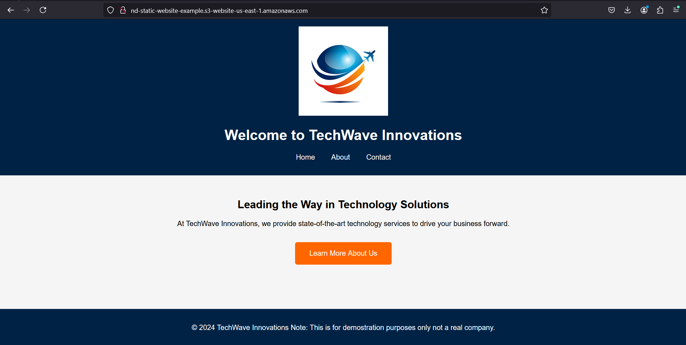

# AWS Static Website Portfolio Piece  

This project demonstrates my ability to deploy a fully functional static website using Amazon S3 for hosting. It showcases my skills in configuring AWS services and creating a scalable, secure, and accessible web solution.  
 

  

## Live Demo  
Explore the live site here:  
[nd-static-website-example](http://nd-static-website-example.s3-website-us-east-1.amazonaws.com/)  

## Project Highlights  
- **S3 Static Hosting:** Configured an S3 bucket to serve as a static web host.  
- **Public Accessibility:** Implemented bucket policies to ensure secure yet accessible read-only access for all visitors.  
- **Optimized Deployment:** Efficiently structured and deployed static assets to demonstrate AWS-hosted web solutions.  

## Skills Demonstrated  
- Amazon S3 configuration and policy management.  
- Hosting static content and ensuring proper permissions for public access.  

## Key Configurations  
- **Bucket Policy:** Designed to allow secure public access while maintaining S3 best practices.  
- **Static Website Hosting:** Enabled S3 static hosting with a dedicated endpoint for seamless website delivery.  

## Why This Matters  
This project reflects my understanding of cloud-based hosting solutions and my ability to leverage AWS services for practical applications. It’s a testament to my skills in deploying reliable, scalable, and cost-effective solutions for static websites.  

## About the Website  
The demo website features:  
- A responsive `index.html` page for general-purpose viewing.  
- Clear, accessible design to emphasize content delivery.  

## Future Enhancements  
- Set up a secondary S3 bucket in a different region for disaster recovery and backup purposes.  
